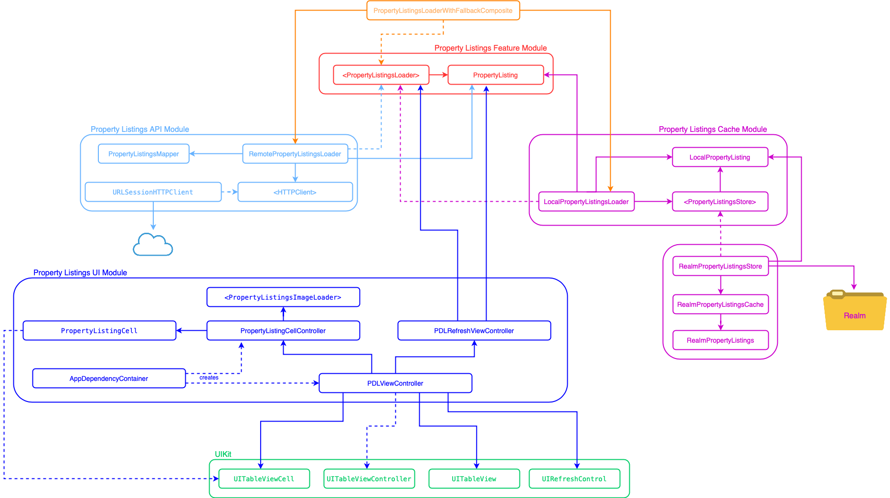

# Test technique - Groupe SeLoger


## Property Listings Feature Specs

### Story: User requests to see the property listings

### Narrative #1
```
As an online user,
I want the app to automatically load the latest property listings
So I can always see the latest property listings
```

#### Scenarios (Acceptance criteria)
```
Given the user has connectivity
 When the user requests to see the property listings
 Then the app should display the latest property listings from remote
  And replace the cache with the new property listings
```

### Narrative #2
```
As an offline user,
I want the app to automatically load the latest saved property listings
So I can always see the property listings
```

#### Scenarios (Acceptance criteria)
```
Given the user doesn't have connectivity
  And there’s a cached version of the property listings
 When the user requests to see the property listings
 Then the app should display the property listings saved
  
Given the user doesn't have connectivity
  And the cache is empty
 When the user requests to see the property listings
 Then the app should display an error message
```

## Use Cases

### Load Property Listings From Remote Use Case

#### Data:
- URL

#### Primary course (happy path):
1. Execute "Load Property Listings" command with above data.
2. System downloads data from the URL.
3. System validates downloaded data.
4. System creates property listings from valid data.
5. System delivers property listings.

#### Invalid data - error course (sad path):
1. System delivers invalid data error.

#### No connectivity - error course (sad path):
1. System delivers connectivity error.

---

### Load Property Listings Image Data From Remote Use Case

#### Data:
- URL

#### Primary course (happy path):
1. Execute "Load Image Data" command with above data.
2. System downloads data from the URL.
3. System validates downloaded data.
4. System delivers image data.

#### Cancel course:
1. System does not deliver image data nor error.

#### Invalid data – error course (sad path):
1. System delivers invalid data error.

#### No connectivity – error course (sad path):
1. System delivers connectivity error.

---

### Load Property Listings From Cache Use Case

#### Primary course (happy path):
1. Execute "Load Property Listings Items" command with above data.
2. System retrieves property listings data from cache.
3. System creates property listings items from cached data.
4. System delivers property listings.

#### Retrieval error course (sad path):
1. System delivers error.

#### Empty cache course (sad path):
1. System delivers no property listing.

---

### Load Property Listings Image Data From Cache Use Case

#### Data:
- URL

#### Primary course (happy path):
1. Execute "Load Image Data" command with above data.
2. System retrieves data from the cache.
3. System delivers cached image data.

#### Cancel course:
1. System does not deliver image data nor error.

#### Retrieval error course (sad path):
1. System delivers error.

#### Empty cache course (sad path):
1. System delivers not found error.

---

### Validate Property Listings Cache Use Case

#### Primary course (happy path):
1. Execute “Validate Cache” command with above data.
2. System retrieves property listings data from cache.

#### Retrieval error course (sad path):
1. System deletes cache

---

### Save Property listings to Cache Use Case

#### Data:
- Property Listings Items

#### Primary course:
1. Execute "Save Property Listings Items" command with above data.
2. System deletes old cache data.
3. System encode property listings items.
4. System saves new cache data.
5. System delivers success message.

#### Deleting error course (sad path):
1. System delivers an error.

#### Saving error course (sad path):
1. System delivers an error.

---

### Save Property Listings Image Data Use Case

#### Data:
- Image Data

#### Primary course (happy path):
1. Execute "Save Image Data" command with above data.
2. System caches image data.
3. System delivers success message.

#### Saving error course (sad path):
1. System delivers error.

---

## Model Specs

### Property listing

| Property       | Type                |
|----------------|---------------------|
| `bedrooms`     | `Int`               |
| `city`         | `String`            |
| `id`           | `Int`               |
| `area`	     | `Float`             |
| `url`	         | `URL`               |
| `price`	     | `Float`             |
| `professional` | `String`            |
| `propertyType` | `String`            |
| `rooms`	     | `Int`               |

### Payload contract

```
GET /listings.json

200 RESPONSE

{
    "items": [
        {
            "bedrooms": 4,
            "city": "Villers-sur-Mer",
            "id": 1,
            "area": 250.0,
            "url": "https://v.seloger.com/s/crop/590x330/visuels/1/7/t/3/17t3fitclms3bzwv8qshbyzh9dw32e9l0p0udr80k.jpg",
            "price": 1500000.0,
            "professional": "GSL EXPLORE",
            "propertyType": "Maison - Villa",
            "rooms": 8
        },
        {
            "bedrooms": 7,
            "city": "Deauville",
            "id": 2,
            "area": 600.0,
            "url": "https://v.seloger.com/s/crop/590x330/visuels/2/a/l/s/2als8bgr8sd2vezcpsj988mse4olspi5rfzpadqok.jpg",
            "price": 3500000.0,
            "professional": "GSL STICKINESS",
            "propertyType": "Maison - Villa",
            "rooms": 11
        },
        {
            "city": "Bordeaux",
            "id": 3,
            "area": 550.0,
            "price": 3000000.0,
            "professional": "GSL OWNERS",
            "propertyType": "Maison - Villa",
            "rooms": 7
        },
        {
            "city": "Nice",
            "id": 4,
            "area": 250.0,
            "url": "https://v.seloger.com/s/crop/590x330/visuels/1/9/f/x/19fx7n4og970dhf186925d7lrxv0djttlj5k9dbv8.jpg",
            "price": 5000000.0,
            "professional": "GSL CONTACTING",
            "propertyType": "Maison - Villa"
        }
    ],
    "totalCount": 4
}
```

---

## Property Detail Feature Specs

### Story: User requests to see Property Details

### Narrative

```
As an online user
I want the app to load the property details
So I can see more information about the property
```

#### Scenarios (Acceptance criteria)

```
Given the user has connectivity
 When the user requests to see more information on a property
 Then the app should display all informations for that property
```

```
Given the user doesn't have connectivity
 When the user requests to see more information on a property
 Then the app should display an error message
```

## Use Cases

### Load Property Details From Remote Use Case

#### Data:
- ListingID

#### Primary course (happy path):
1. Execute "Load Property Details" command with above data.
2. System loads data from remote service.
3. System validates data.
4. System creates property details from valid data.
5. System delivers property details.

#### Invalid data – error course (sad path):
1. System delivers invalid data error.

#### No connectivity – error course (sad path):
1. System delivers connectivity error.

---

## Model Specs

### Property Details (Same as Property listing)

| Property       | Type                |
|----------------|---------------------|
| `bedrooms`     | `Int`               |
| `city`         | `String`            |
| `id`           | `Int`               |
| `area`	     | `Float`             |
| `url`	         | `URL`               |
| `price`	     | `Float`             |
| `professional` | `String`            |
| `propertyType` | `String`            |
| `rooms`	     | `Int`               |

### Payload contract

```
GET /listings/{listingId}.json

2xx RESPONSE

{
    "bedrooms": 7,
    "city": "Deauville",
    "id": 2,
    "area": 600.0,
    "url": "https://v.seloger.com/s/crop/590x330/visuels/2/a/l/s/2als8bgr8sd2vezcpsj988mse4olspi5rfzpadqok.jpg",
    "price": 3500000.0,
    "professional": "GSL STICKINESS",
    "propertyType": "Maison - Villa",
    "rooms": 11
}
```

---

## App Architecture


